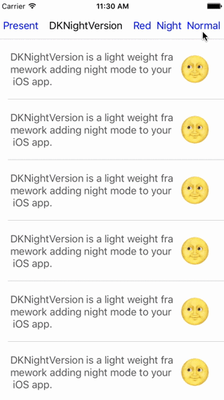
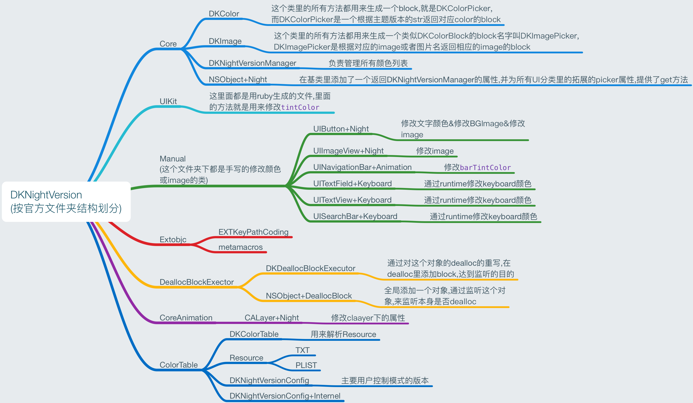
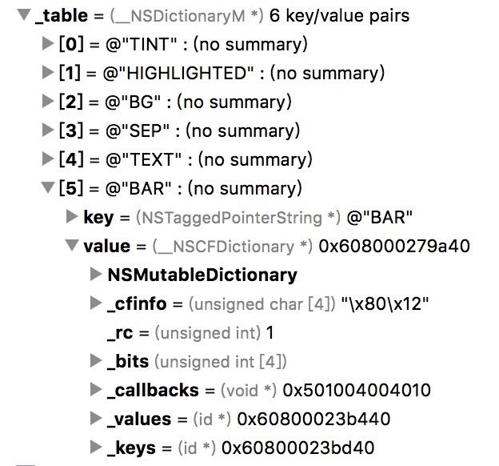

# DKNightVersion源码阅读笔记

DKNightVersion是git上一款优秀的切换主题的第三方库,如图所示,你可以自定义主题,自由的切换文字&背景&图片的颜色与内容,以下是我的学习笔记




地址:[DKNightVersionDemo](https://codeload.github.com/Draveness/DKNightVersion/zip/master)

##结构



##流程

###1. 如何设置默认主题


####以控件UIBarButtonItem为例
```
UIBarButtonItem *normalItem = [[UIBarButtonItem alloc] initWithTitle:@"Normal" style:UIBarButtonItemStylePlain target:self action:@selector(normal)];
normalItem.dk_tintColorPicker = DKColorPickerWithKey(TINT);//TINT是设置batButtonItem的tint属性的意思
```

####1.1 创建一个DKNightVersion,然后设定有哪些基本要切换的主题
```
//初始化DKNightVersion,把它变成一个单例,给定基本主题
+ (instancetype)sharedInstance {
    static DKNightVersion *sharedInstance = nil;
    static dispatch_once_t oncePredicate;
    dispatch_once(&oncePredicate, ^{
        sharedInstance = [[self alloc] init];
        sharedInstance.themes = @[DKThemeVersionNormal, DKThemeVersionNight];
    });
    return sharedInstance;
}

```

####1.2 DKColorTable会解析resource,得到对应主题的对应颜色等信息
```
//通过宏定义调取方法
#define DKColorPickerWithKey(key) [[DKColorTable sharedColorTable] pickerWithKey:@#key]
```

```
+ (instancetype)sharedColorTable {
    static DKColorTable *sharedInstance = nil;
    static dispatch_once_t oncePredicate;
    dispatch_once(&oncePredicate, ^{
        sharedInstance = [[DKColorTable alloc] init];
        sharedInstance.themes = DKNightVersion.themes;
        sharedInstance.file = @"DKColorTable.plist";//通过setFile方法解析配置文件
    });
    return sharedInstance;
}

- (void)setFile:(NSString *)file {
    _file = file;
    [self reloadColorTable];
}
```

```
//源码提供了2中解析方式,一种是plist,一种是txt
- (void)reloadColorTable {
    // Clear previos color table
    self.table = nil;

    NSString *pathExtension = self.file.pathExtension;

    if ([pathExtension isEqualToString:@"plist"]) {
        [self loadFromPlist];
    } else if ([pathExtension isEqualToString:@"txt"] || [pathExtension isEqualToString:@""]) {
        [self loadFromPlainText];
    } else {
        NSAssert(NO, @"Unknown path extension %@ for file %@", pathExtension, self.file);
    }
}

//把所有的配置文件解析后存放在self.table中
- (void)loadFromPlist {
    NSString *filepath = [[NSBundle mainBundle] pathForResource:self.file.stringByDeletingPathExtension ofType:self.file.pathExtension];
    NSDictionary *infos = [NSDictionary dictionaryWithContentsOfFile:filepath];
    NSSet *configThemes = [NSSet setWithArray:DKNightVersion.themes];
    for (NSString *key in infos) {
        NSMutableDictionary *themeToColorDictionary = [infos[key] mutableCopy];
        NSSet *themesInFile = [NSSet setWithArray:themeToColorDictionary.allKeys];
        NSAssert([themesInFile isEqualToSet:configThemes], @"Invalid theme to themes to color dictionary %@ for key %@", themeToColorDictionary, key);
        [themeToColorDictionary enumerateKeysAndObjectsUsingBlock:^(NSString * _Nonnull key, NSString * _Nonnull obj, BOOL * _Nonnull stop) {
            UIColor *color = [self colorFromString:obj];
            themeToColorDictionary[key] = color;
        }];
        [self.table setValue:themeToColorDictionary forKey:key];
    }
}
```


####1.3 DKColorTable的pickerWithKey方法会根据对应的属性,选择当前主题下的颜色

```
//注意DKColorPicker是一个block
- (DKColorPicker)pickerWithKey:(NSString *)key {
    NSParameterAssert(key);

	//key='TINT'
	//themeToColorDictionary 里 包含了不同主题下setTintColor可以设置的颜色
	//themeVersion为当前要设定的主题
    NSDictionary *themeToColorDictionary = [self.table valueForKey:key];
    DKColorPicker picker = ^(DKThemeVersion *themeVersion) {
        return [themeToColorDictionary valueForKey:themeVersion];
    };

    return picker;

}
```

####1.4 在setTintColor同时还会保留要改变属性的sel和DKColorPicker,用于之后如果再次改变主题的时候,切换其他模式

```
#import "UIBarButtonItem+Night.h"
#import "DKNightVersionManager.h"
#import <objc/runtime.h>

@interface UIBarButtonItem ()

@property (nonatomic, strong) NSMutableDictionary<NSString *, DKColorPicker> *pickers;//每个空间都有一个pickers属性

@end

@implementation UIBarButtonItem (Night)


- (DKColorPicker)dk_tintColorPicker {
    return objc_getAssociatedObject(self, @selector(dk_tintColorPicker));
}

- (void)dk_setTintColorPicker:(DKColorPicker)picker {
    objc_setAssociatedObject(self, @selector(dk_tintColorPicker), picker, OBJC_ASSOCIATION_COPY_NONATOMIC);
    self.tintColor = picker(self.dk_manager.themeVersion);
    [self.pickers setValue:[picker copy] forKey:@"setTintColor:"];把block和sel放入self.pickers,因为picker是一个block,下次就可以直接根据主题切换颜色了
}

```

###2. 如何切换主题


####2.1 记录了新的主题key(用户下次启动app时调用)同时发送通知,让所有接到通知的控件改变颜色

```
- (void)setThemeVersion:(DKThemeVersion *)themeVersion {
    if ([_themeVersion isEqualToString:themeVersion]) {
        // if type does not change, don't execute code below to enhance performance.
        return;
    }
    _themeVersion = themeVersion;

    // Save current theme version to user default
    [[NSUserDefaults standardUserDefaults] setValue:themeVersion forKey:DKNightVersionCurrentThemeVersionKey];
    [[NSNotificationCenter defaultCenter] postNotificationName:DKNightVersionThemeChangingNotificaiton
                                                        object:nil];

    if (self.shouldChangeStatusBar) {
#pragma clang diagnostic push
#pragma clang diagnostic ignored "-Wdeprecated-declarations"
        if ([themeVersion isEqualToString:DKThemeVersionNight]) {
            [[UIApplication sharedApplication] setStatusBarStyle:UIStatusBarStyleLightContent];
        } else {
            [[UIApplication sharedApplication] setStatusBarStyle:UIStatusBarStyleDefault];
        }
#pragma clang diagnostic pop
    }
}
```

####2.2 改变所有注册了通知的控件颜色
```
- (NSMutableDictionary<NSString *, DKColorPicker> *)pickers {
    NSMutableDictionary<NSString *, DKColorPicker> *pickers = objc_getAssociatedObject(self, @selector(pickers));
    if (!pickers) {
        
        @autoreleasepool {
            // Need to removeObserver in dealloc
            
            //在dealloc里来移除通知
            if (objc_getAssociatedObject(self, &DKViewDeallocHelperKey) == nil) {
				//__unsafe_unretained 这里使用这个属性是为了避免如果使用weak导致对象nil之后无法remove,而__unsafe_unretained只会让对象变成野指针,不影响remove                
                __unsafe_unretained typeof(self) weakSelf = self; // NOTE: need to be __unsafe_unretained because __weak var will be reset to nil in dealloc
                id deallocHelper = [self addDeallocBlock:^{
                    
                    [[NSNotificationCenter defaultCenter] removeObserver:weakSelf];
                }];
                objc_setAssociatedObject(self, &DKViewDeallocHelperKey, deallocHelper, OBJC_ASSOCIATION_ASSIGN);
            }
        }

        pickers = [[NSMutableDictionary alloc] init];
        objc_setAssociatedObject(self, @selector(pickers), pickers, OBJC_ASSOCIATION_RETAIN_NONATOMIC);
        
        [[NSNotificationCenter defaultCenter] removeObserver:self name:DKNightVersionThemeChangingNotificaiton object:nil];

        [[NSNotificationCenter defaultCenter] addObserver:self selector:@selector(night_updateColor) name:DKNightVersionThemeChangingNotificaiton object:nil];
    }
    return pickers;
}

//通过self.pickers 遍历,找到里面的picker然后通过主题改变颜色
- (void)night_updateColor {
    [self.pickers enumerateKeysAndObjectsUsingBlock:^(NSString * _Nonnull selector, DKColorPicker  _Nonnull picker, BOOL * _Nonnull stop) {
        SEL sel = NSSelectorFromString(selector);
        id result = picker(self.dk_manager.themeVersion);
        [UIView animateWithDuration:DKNightVersionAnimationDuration
                         animations:^{
#pragma clang diagnostic push
#pragma clang diagnostic ignored "-Warc-performSelector-leaks"
                             [self performSelector:sel withObject:result];
#pragma clang diagnostic pop
                         }];
    }];
}
```

###3. 如何切换图片

切换图片与切换颜色类似,可以参考上面的逻辑


####3.1 DKImage的DKImagePickerWithNames方法会返回一个DKImagePicker(block)

```
DKImagePicker DKImagePickerWithNames(NSString *normalName, ...) {
    
    NSArray<DKThemeVersion *> *themes = [DKColorTable sharedColorTable].themes;
    NSMutableArray<NSString *> *names = [[NSMutableArray alloc] initWithCapacity:themes.count];
    [names addObject:normalName];
    NSUInteger num_args = themes.count - 1;
    va_list names_list;//VA_LIST 是在C语言中解决变参问题的一组宏,用于获取不确定个数的参数
#pragma clang diagnostic push
#pragma clang diagnostic ignored "-Wvarargs"
    va_start(names_list, num_args);// 这里把上面得到的字符指针跳过num_args的内存地址
#pragma clang diagnostic pop
    for (NSUInteger i = 0; i < num_args; i++) {
        NSString *name = va_arg(names_list, NSString *);//会从第二个可变参数开始读取数据
        [names addObject:name];
    }
    va_end(names_list);//结束

    return [DKImage pickerWithNames:names];
}
```

具体可变参数的资料,可以参考这篇文章:[全面解析C语言中可变参数列表](http://blog.csdn.net/yuzhihui_no1/article/details/43734663)

####3.2 DKImagePicker会根据当前的主题,选择返回的img

```
//返回一个DKImagePicker,DKImagePicker里面会根据当前的主题,选择names里对应的img
+ (DKImagePicker)pickerWithNames:(NSArray<NSString *> *)names {
    DKColorTable *colorTable = [DKColorTable sharedColorTable];
    NSParameterAssert(names.count == colorTable.themes.count);
    return ^(DKThemeVersion *themeVersion) {
        NSUInteger index = [colorTable.themes indexOfObject:themeVersion];
        if (index >= colorTable.themes.count) {
            return [UIImage imageNamed:names[[colorTable.themes indexOfObject:DKThemeVersionNormal]]];
        }
        return [UIImage imageNamed:names[index]];
    };
}
```
####3.3 对应的imageView会有一个分类,当set分类里的方法的时候,会根据传过来的DKImagePicker返回的img,进行赋值,并把block和sel存入self.pickers字典

```
- (void)dk_setImagePicker:(DKImagePicker)picker {
    objc_setAssociatedObject(self, @selector(dk_imagePicker), picker, OBJC_ASSOCIATION_COPY_NONATOMIC);
    self.image = picker(self.dk_manager.themeVersion);
    [self.pickers setValue:[picker copy] forKey:@"setImage:"];

}
```


##总结
DKNightVersion是一个相对成熟的切换主题的第三方库了,因为公司的需要,也是花了一点时间阅读了他的源码,感觉开阔了一些自己的思路,值得注意的是,作者是我们国人,他的博客地址:[博客地址](http://draveness.me/)真的很优秀的开发者,值得我们所有人学习!


