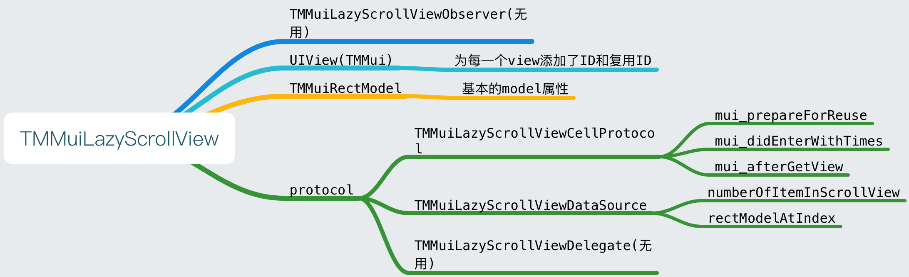

# LazyScrollView源码阅读笔记

LazyScrollView是一个类似TableView的高性能滚动视图,他的作者在开源的同时,提供了详细的内容介绍,如下:

[LazyScrollView中文说明](http://pingguohe.net/2016/01/31/lazyscroll.html)
[LazyScrollView中文Demo说明](http://pingguohe.net/2017/03/02/lazyScrollView-demo.html)

我的笔记只是我的一些补充内容与思考,以下是我的学习笔记

--

结构:**非常简单&易懂**


--

当数据存在,所有的展示,都是从一次reload开始

```
- (void)reloadData
{
    //得到所有的item的位置,并按位置从上到下和从下到上,分别排序为2个数组
    [self creatScrollViewIndex];
    if (self.itemsFrames.count > 0) {
        
        CGRect visibleBounds = self.bounds;
        
        //根据self.bounds,得到需要复用的最大Y值和最小Y值
        CGFloat minY = CGRectGetMinY(visibleBounds) - RenderBufferWindow;
        CGFloat maxY = CGRectGetMaxY(visibleBounds) + RenderBufferWindow;
        
        //计算并展示需要展示的view,回收消失的view
        [self assembleSubviewsForReload:YES minY:minY maxY:maxY];
        
        //通过对比,计算复用view,出现的time
        //如果自己实现类似的Scrollview可以不是实现这个方法,只需要根据业务看是否刷新lastVisiblemuiID即可
        [self findViewsInVisibleRect];
    
    }
}
```

这里需要详细解释一下方法:

```
- (void)assembleSubviewsForReload:(BOOL)isReload minY:(CGFloat)minY maxY:(CGFloat)maxY
{
  
    //得到在Buffer下那些view在展示的区域内
    NSSet *itemShouldShowSet = [self showingItemIndexSetFrom:minY to:maxY];
    //得到在bounds下那些view在展示的区域内
    self.muiIDOfVisibleViews = [self showingItemIndexSetFrom:CGRectGetMinY(self.bounds) to:CGRectGetMaxY(self.bounds)];

    NSMutableSet  *recycledItems = [[NSMutableSet alloc] init];

    //如果之前有过一次reload,那么visibleItem会有数据,这个操作就是为了,找到那些view应该被回收,那些应该展示
    //第一次reload没有数据
    NSSet *visibles = [self.visibleItems copy];
    
    for (UIView *view in visibles)
    {
        //先确定view是否在展示区域,不在的被回收,在的加入要reload数组
        BOOL isToShow  = [itemShouldShowSet containsObject:view.muiID];
        
        if (!isToShow && view.reuseIdentifier.length > 0)
        {

            NSMutableSet *recycledIdentifierSet = [self recycledIdentifierSet:view.reuseIdentifier];
            [recycledIdentifierSet addObject:view];
            [view removeFromSuperview];
            [recycledItems addObject:view];
        }
        else if (isReload && view.muiID) {
            [self.shouldReloadItems addObject:view.muiID];
        }
    }
    
    //取差集
    [self.visibleItems minusSet:recycledItems];
    [recycledItems removeAllObjects];

    for (NSString *muiID in itemShouldShowSet)
    {
        BOOL shouldReload = isReload || [self.shouldReloadItems containsObject:muiID];
        if(![self isCellVisible:muiID] || [self.shouldReloadItems containsObject:muiID])
        {
            if (self.dataSource && [self.dataSource conformsToProtocol:@protocol(TMMuiLazyScrollViewDataSource)] &&
                [self.dataSource respondsToSelector:@selector(scrollView: itemByMuiID:)])
            {
                //如果调用了reload,或者shouldReloadItems包含了这个id,则从计算出来的visibleItems里寻找item
                if (shouldReload) {
                    self.currentVisibleItemMuiID = muiID;
                }
                else {
                    /*
                    如果没有调用reload,或者shouldReloadItems不包含了这个id,则创建一个新的view
                    在代理方法
                    - (UIView *)scrollView:(TMMuiLazyScrollView *)scrollView itemByMuiID:(NSString *)muiID中
                    */
                    self.currentVisibleItemMuiID = nil;
                }
                
                UIView *viewToShow = [self.dataSource scrollView:self itemByMuiID:muiID];

                if ([viewToShow conformsToProtocol:@protocol(TMMuiLazyScrollViewCellProtocol)] &&
                    [viewToShow respondsToSelector:@selector(mui_afterGetView)]) {
                    [(UIView<TMMuiLazyScrollViewCellProtocol> *)viewToShow mui_afterGetView];
                }
                
                //如果没有加入visibleItems,加入visibleItems数组
                if (viewToShow)
                {
                    viewToShow.muiID = muiID;
                    if (![self.visibleItems containsObject:viewToShow]) {
                        [self.visibleItems addObject:viewToShow];
                    }
                }
            }
            //从应该要reload的数组里删除
            [self.shouldReloadItems removeObject:muiID];
        }
    }
}
```

寻找复用view的逻辑

```
- (nullable UIView *)dequeueReusableItemWithIdentifier:(NSString *)identifier
{
    UIView *view = nil;
    if (self.currentVisibleItemMuiID) {
        NSSet *visibles = self.visibleItems;
        for (UIView *v in visibles) {
            if ([v.muiID isEqualToString:self.currentVisibleItemMuiID]) {
                view = v;
                break;
            }
        }
    }
    if (nil == view) {
        NSMutableSet *recycledIdentifierSet = [self recycledIdentifierSet:identifier];
        view = [recycledIdentifierSet anyObject];
        if (view)
        {
            //if exist reusable view , remove it from recycledSet.
            [recycledIdentifierSet removeObject:view];
            //NSLog(@"从复用池删除,此时复用池有 count = %ld",recycledIdentifierSet.count);
            //Then remove all gesture recognizers of it.
            view.gestureRecognizers = nil;
        }
    }
    if ([view conformsToProtocol:@protocol(TMMuiLazyScrollViewCellProtocol)] && [view respondsToSelector:@selector(mui_prepareForReuse)]) {
        [(UIView<TMMuiLazyScrollViewCellProtocol> *)view mui_prepareForReuse];
    }
    return view;
}
```


```
- (NSMutableSet *)recycledIdentifierSet:(NSString *)reuseIdentifier;
{
    if (reuseIdentifier.length == 0)
    {
        return nil;
    }
    
    //会把一类reuseIdentifier的view组合成一个可变集合,放入复用池
    NSMutableSet *result = [self.recycledIdentifierItemsDic objectForKey:reuseIdentifier];
    if (result == nil) {
        result = [[NSMutableSet alloc] init];
        [self.recycledIdentifierItemsDic setObject:result forKey:reuseIdentifier];
    }
    return result;
}
```

为什么这里的复用池使用了一个dict,里面根据reuseIdentifier放一个集合,我这里猜想是因为天猫本身可能会有很多类的view,如果都放入一个数组里,可能会导致如下问题:

```
A_view 10个
B_view 10个
C_view 10个

想找到A,却要遍历所有种类的view

for (int i = 0; i < 10+10+10 ;i++)
{
	if (a){
		break;
	}
}

--

如果是dict,只需要取出dict,得到set就可以遍历

NSSet *aSet = [dict objectForKey:@"xxx"];

for (int i = 0; i < aSet.count ;i++)
{
	if (a){
		break;
	}
}

```

>**个人认为:**如果是要做类别很多的,而且view的frame相对不大的滚动视图,可以用这样的方式,如果view的frame很大,例如接近一屏幕,可以考虑直接放入一个数组即可.

--

### buffer的概念

个人认为buffer的概念主要用于,优化scrollViewDidScroll里的计算时间,为了防止每一次scroll微小的滚动带来的计算消耗,源码如下

```
CGFloat currentY = scrollView.contentOffset.y;
CGFloat buffer = RenderBufferWindow / 2;
//如果大于buffer的值,才会进行计算
if (buffer < ABS(currentY - self.lastScrollOffset.y)) {
   self.lastScrollOffset = scrollView.contentOffset;
   [self assembleSubviews];
   [self findViewsInVisibleRect];

}
```

--

一些其他细节,在工程里,它大量用了集合NSSet,而非NSArray,具体为什么可以参考下面的链接:[NSArray和NSSet的区别](http://www.cnblogs.com/lwk151124/p/5729766.html)

我只粘贴一下精华,如下:

>NSSet  ， NSMutableSet类声明编程接口对象，无序的集合，在内存中存储方式是不连续的
>
像NSArray，NSDictionary（都是有序的集合）类声明编程接口对象是有序集合，在内存中存储位置是连续的；

>NSSet和我们常用NSArry区别是：在搜索一个一个元素时NSSet比NSArray效率高，主要是它用到了一个算法hash(散列，也可直译为哈希)；

--

这份源码阅读笔记相对简单,如果想更详细的了解,建议大家还是去阅读源码(源码量不多,最多一天就读完),再加上作者的文章辅助,相信会对它的原理了解的更多,如果以后大家想自己实现一个类似这样的高性能视图,这份源码可能是一个不错的选择~

 

